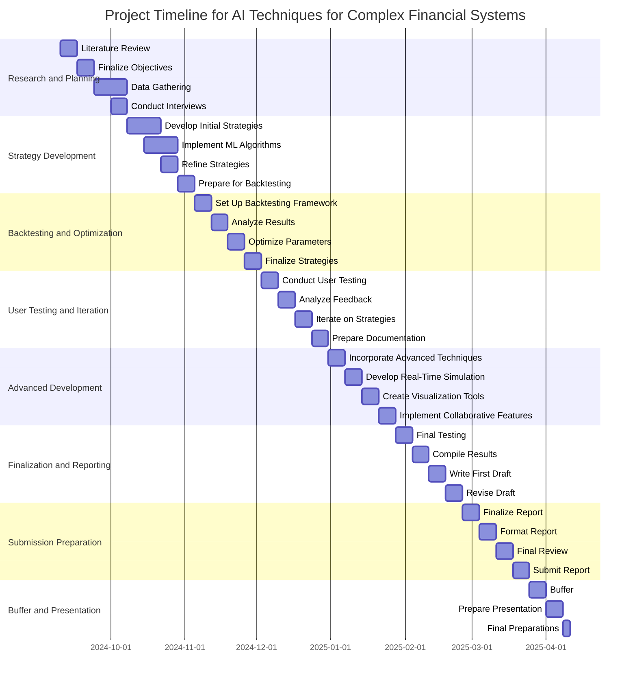

# AI Techniques for Complex Financial Systems

**Using advanced algorithmic methods and machine learning to enhance stock market trading strategies and decision-making.**

**Student:** James Taylor  
**Candidate Number:** XXXXXX  
**Supervisor:** Dr. Julian Gutierrez  

## Aims

The financial markets present a complex environment where traders seek to maximize their returns by employing a variety of strategies. Traditional trading methods often rely on heuristics and experience, but with the increasing availability of historical data, there is significant potential to enhance trading decisions through algorithmic approaches. This project will explore the development and evaluation of stock market trading strategies using historical data and various AI techniques, including decision theory and machine learning.

The project aims to address the following challenges faced by traders:

1. Identifying profitable trading opportunities through systematic analysis of historical data.
2. Evaluating the effectiveness of different trading strategies under varying market conditions.
3. Enhancing decision-making processes using data-driven insights.

By utilizing user-centered design principles, this project will focus on creating an accessible platform that allows users to analyze and visualize the performance of trading strategies effectively.

## Objectives

### Primary Objectives

1. **Research and Evaluation:** Conduct a comprehensive review of existing trading strategies and AI techniques utilized in financial markets. Identify gaps in current methodologies and best practices.
2. **Data Collection:** Gather and preprocess historical stock market data, including price movements, trading volumes, and other relevant metrics.
3. **Strategy Development:** Develop a range of trading strategies using decision theory methods and machine learning algorithms, including but not limited to regression analysis, reinforcement learning, and time series forecasting.
4. **Backtesting:** Implement backtesting frameworks to evaluate the performance of developed trading strategies against historical data, assessing metrics such as return on investment (ROI) and risk-adjusted returns.
5. **Parameter Optimization:** Explore techniques for optimizing the parameters of trading strategies to enhance their performance and adaptability to changing market conditions.
6. **User Testing:** Design and conduct user testing sessions with traders and analysts to gather feedback on the usability and effectiveness of the developed strategies and platform.
7. **Iterative Improvement:** Use feedback from user testing to refine and improve the strategies and the overall platform.

### Extensions

1. **Advanced Modeling:** Incorporate advanced machine learning techniques, such as deep learning and ensemble methods, to further enhance trading strategy performance.
2. **Real-Time Trading Simulation:** Develop a real-time trading simulation environment to test strategies under live market conditions.
3. **Visualization Tools:** Create interactive visualization tools to help users understand and interpret the performance of different trading strategies effectively.
4. **Collaborative Features:** Implement collaborative features that allow users to share strategies, insights, and results with a community of traders.

## Relevance

This project encompasses a blend of programming, mathematical modeling, and financial analysis, providing an opportunity to apply theoretical knowledge in a practical context. It will not only enhance my technical skills in Python programming and data analysis but also improve my understanding of financial markets and decision-making processes. The insights gained from this project could have real-world applications for traders seeking to enhance their performance and adapt to dynamic market conditions.

As someone passionate about finance and technology, this project allows me to combine my interests in a meaningful way. The experience of working with complex financial systems and developing algorithmic trading strategies will be invaluable for my future career in finance or data science.

## Resources Required

This project will require access to financial databases for historical stock data, coding environments for Python development, and possibly cloud computing resources for running intensive data analysis and backtesting. Additionally, access to seminar rooms may be necessary for conducting user testing and gathering feedback from stakeholders in the finance sector. Collaboration with financial analysts or traders may also provide valuable insights into the practical applications of the developed strategies.

### Project Timescale

