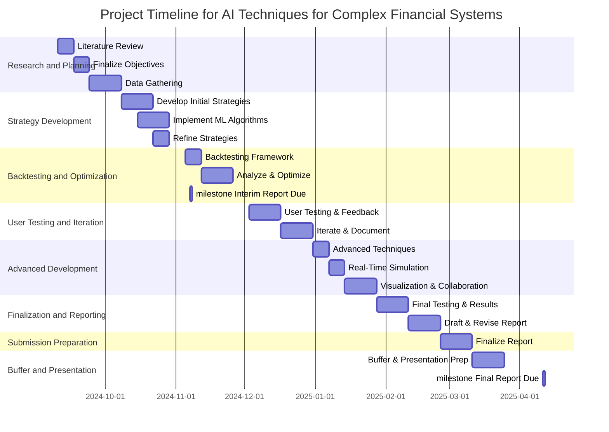

# AI Techniques for Complex Financial Systems

**Using advanced algorithmic methods and machine learning to enhance stock market trading strategies and decision-making.**

**Student:** James Taylor  
**Candidate Number:** XXXXXX  
**Supervisor:** Dr. Julian Gutierrez  

## Aims

Modern-day financial markets are complex environments in which traders seek to maximize their returns. This is usually done by employing many different strategies. Over the years there have been many other methods which they have relied on, But with the availability of historical data, There is a massive potential to develop a decision-algorithmic approach. This project will follow my development and understanding of different stock market trading strategies using historical data and different AI techniques, These include decision theory and machine learning.

The project aims to address the following challenges faced by traders:

1. Outlining the profitable trading strategies through systematic analysis of historical data.
2. Evaluation of these different trading strategies within different market conditions.
3. And finally the development of enhancing decision-making using data-driven insights.

## Objectives

### Primary Objectives

1. **Research and Evaluation:** Conduct a comprehensive review of existing trading strategies and AI techniques utilized in financial markets. Identify gaps in current methodologies and best practices.
2. **Data Collection:** Gather and preprocess historical stock market data, including price movements, trading volumes, and other relevant metrics.
3. **Strategy Development:** Develop a range of trading strategies using decision theory methods and machine learning algorithms, including but not limited to regression analysis, reinforcement learning, and time series forecasting.
4. **Parameter Optimization:** Explore techniques for optimizing the parameters of trading strategies to increase their performance and adaptability to changing market conditions.
5. **User Testing:** Design and conduct user testing sessions to gather feedback on the effectiveness of the strategies and platform.
6. **Iterative Improvement:** Use feedback from user testing to refine and improve the strategies and the overall platform.

### Extensions

1. **Advanced Modeling:** Include machine learning techniques. This would include processes such as deep learning and ensemble methods. These will further the strategy and performance.
2. **Trading Simulation:** Create and develop a trading simulation environment to test strategies under market conditions.

## Relevance

Overall this project will use a blend of programming, mathematical modeling, and financial analysis. This massively enhances my technical skills in Python programming and data analysis. Furthermore, it will develop my understanding of financial markets and the processes within them. With this gained understanding I will have a skill which I can take to real-world applications.

I'm an individual who is passionate about AI and big data. This project will combine both of these interests and help me further improve my experience. I also feel this will be invaluable for my future career.

## Resources Required

Outlining the resources required for this project is a difficult task. With research, I've defined some key areas which will be needed. These include access to historical stock data. A coding environment for developing the Python program. Potential the introduction of cloud computing resources for running data analysis and solid backtesting. Also, the potential to speak to financial analysts to develop an even greater understanding of the financial world. With these insights, it should further help with the practical application.

### Project Timescale

